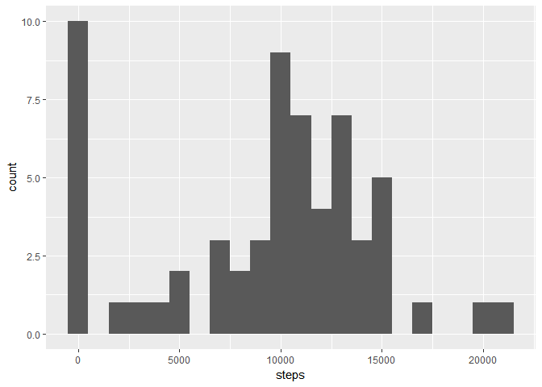
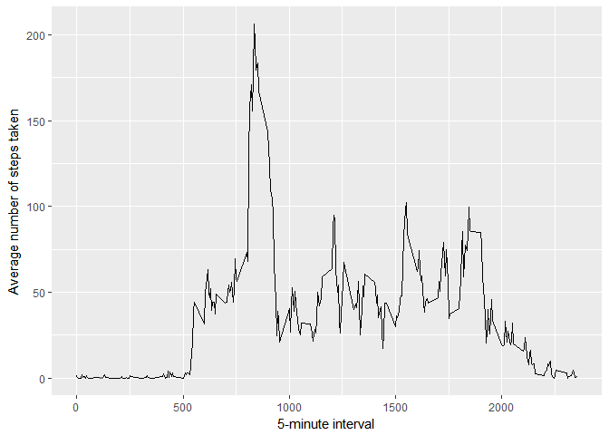
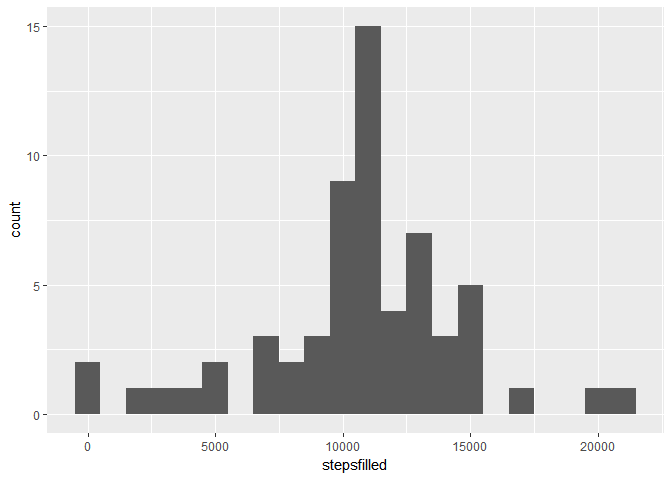
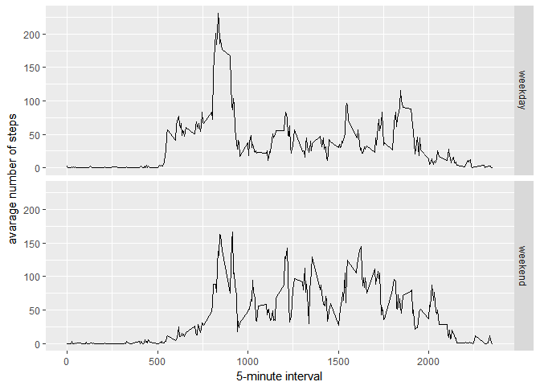

# Reproducible Research: Peer Assessment 1


## Loading and preprocessing the data


```r
if(!file.exists('activity.csv')){
    unzip('activity.zip')
}
data <- read.csv("activity.csv")
```

## What is mean total number of steps taken per day?
##### 1. Make a histogram of the total number of steps taken each day

```r
library(ggplot2)
steps <- tapply(data$steps, data$date, FUN=sum, na.rm=TRUE)
qplot(steps, binwidth=1000)
```

<!-- -->

##### 2. Calculate and report the mean total number of steps taken per day

```r
round(mean(steps, na.rm=TRUE))
```

```
## [1] 9354
```
##### 3. Calculate and report the median total number of steps taken per day

```r
round(median(steps, na.rm=TRUE))
```

```
## [1] 10395
```

## What is the average daily activity pattern?


##### 1. Make a time series plot of the 5-minute interval (x-axis) and the average number of steps taken, averaged across all days (y-axis)

```r
avg <- aggregate(x=list(steps=data$steps), by=list(interval=data$interval),
                      FUN=mean, na.rm=TRUE)
ggplot(data=avg, aes(x=interval, y=steps)) +
        xlab("5-minute interval") +
    ylab("Average number of steps taken") +
    geom_line()
```

<!-- -->

##### 2. Which 5-minute interval, on average across all the days in the dataset, contains the maximum number of steps?


```r
gsub("([0-9]{1,2})([0-9]{2})", "\\1:\\2", avg[which.max(avg$steps),'interval'])
```

```
## [1] "8:35"
```

## Imputing missing values

There are a number of days/intervals where there are missing values (coded as NA). The presence of missing days may introduce bias into some calculations or summaries of the data.

##### 1. Calculate and report the total number of missing values in the dataset (i.e. the total number of rows with NAs)


```r
sum(is.na(data$steps))
```

```
## [1] 2304
```

##### 2. Devise a strategy for filling in all of the missing values in the dataset. The strategy does not need to be sophisticated. For example, you could use the mean/median for that day, or the mean for that 5-minute interval, etc.u

We will fill missing values with the average number of steps in the same 5-min interval

##### 3. Create a new dataset that is equal to the original dataset but with the missing data filled in.


```r
datafilled <- data
na <- is.na(datafilled$steps)
avg_interval <- tapply(datafilled$steps, datafilled$interval, mean, na.rm=TRUE, simplify=TRUE)
datafilled$steps[na] <- avg_interval[as.character(datafilled$interval[na])]
```

##### 4. Make a histogram of the total number of steps taken each day


```r
stepsfilled <- tapply(datafilled$steps, datafilled$date, FUN=sum)
qplot(stepsfilled, binwidth=1000)
```

<!-- -->

##### 5. Calculate and report the mean total number of steps taken per day

```r
mean(stepsfilled)
```

```
## [1] 10766.19
```
##### 6. Calculate and report the median total number of steps taken per day

```r
median(stepsfilled)
```

```
## [1] 10766.19
```

Now that we have filled missing data with the average number of steps in the same 5-min interval, median and mean are equal.

## Are there differences in activity patterns between weekdays and weekends?

##### 1. Create a new factor variable in the dataset with two levels - "weekday" and "weekend" indicating whether a given date is a weekday or weekend day.


```r
datafilled$dateType <-  ifelse(as.POSIXlt(datafilled$date)$wday %in% c(0,6), 'weekend', 'weekday')
```

##### 2. Make a panel plot containing a time series plot


```r
avgDatafilled <- aggregate(steps ~ interval + dateType, data=datafilled, mean)
ggplot(avgDatafilled, aes(interval, steps)) + 
    geom_line() + 
    facet_grid(dateType ~ .) +
    xlab("5-minute interval") + 
    ylab("avarage number of steps")
```

<!-- -->

The patterns are different. The subject is more active at the beginning of the day during weekdays, and less active during the afternoon. During weekends, the subject is more active in the afternoon.
